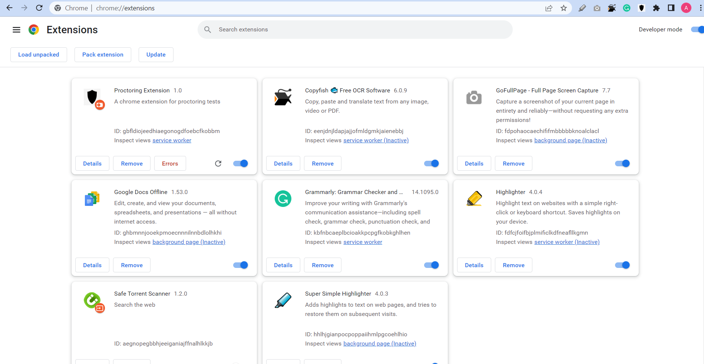
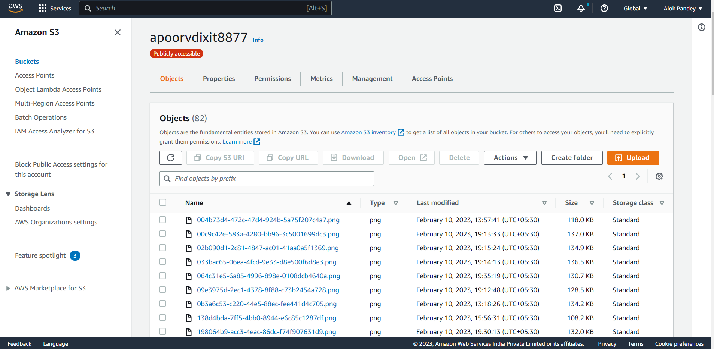

# Proctoring Extension

#Readme is in progress, more elaborated readme will be added by 7pm today

# Overview!

A Chrome extension that operates on assessment websites, activating when a user opens a test page. It opens a form for the user to enter their name, email, and test invitation code, and upon clicking the "Start Test" button, the user's information is sent to the backend server for storage. The extension performs a camera and audio check, and initiates image proctoring, sending images to the server every three minutes (configurable). All image and user activity data are stored on the backend server.

An admin panel is provided to view user details (Along with images at particular timestamp).

</p>

<p align="center">
  
</p>

## Clone to Local Storage

Clone the extesion using git:
`bash $ git clone "repo URL" `

## Install Locally

1. Open chrome and navigate to extensions page using this URL: [`chrome://extensions`](chrome://extensions).
1. Make sure "**Developer mode**" is enabled.
1. Click "**Load unpacked extension**" button, browse the `proctor/dist` directory and select it.



<br>

## Run Locally

Open two terminals for backend and admin(frontend) dashboard

- For backend:

```bash
$ cd backend # moving to directory

$ npm i # install dependencies

$ nodemon app.js #run server for backend
```

- For Frontend Admin-Dashboard

```bash
$ cd admin # moving to directory

$ npm i # install dependencies

$ npm start # run server for dash board
```

<br>

## Creating S3 Bucket

1. Setup cloud bucket to store/retrieve photos: [Link](https://docs.aws.amazon.com/AmazonS3/latest/userguide/creating-bucket.html)
2. Create Access Key and Security Key!

https://docs.aws.amazon.com/AmazonS3/latest/userguide/creating-bucket.html



## Creating MongoDB

1. Create Mongo Cluster to store User's Data: [Link](https://www.mongodb.com/basics/clusters/mongodb-cluster-setup)


## Creating env variable

Create the following variables in ENV

AWS_BUCKET_NAME = ""
AWS_BUCKET_REGION = ""
AWS_ACCESS_KEY = ""
AWS_SECRET_KEY = ""

MONGO_URL=""
