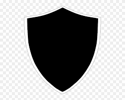
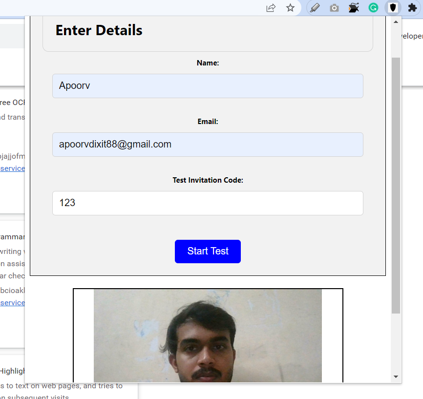
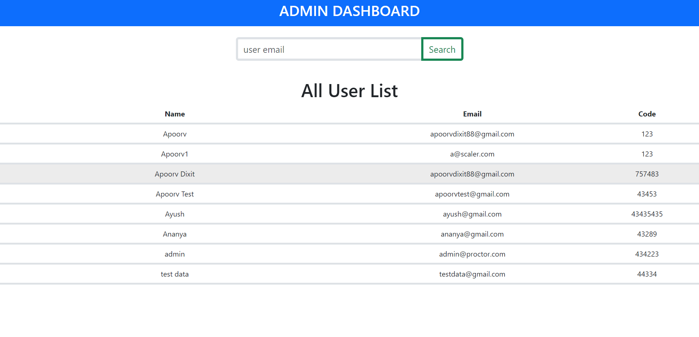
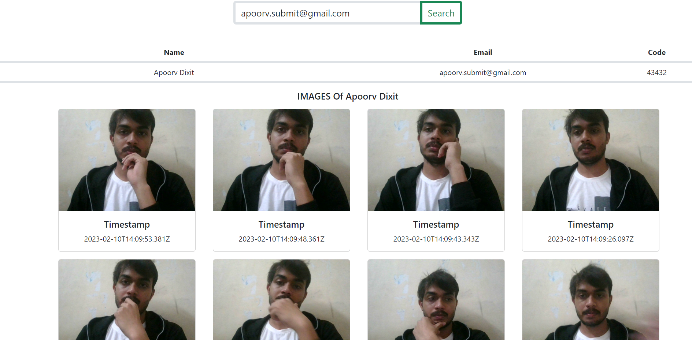
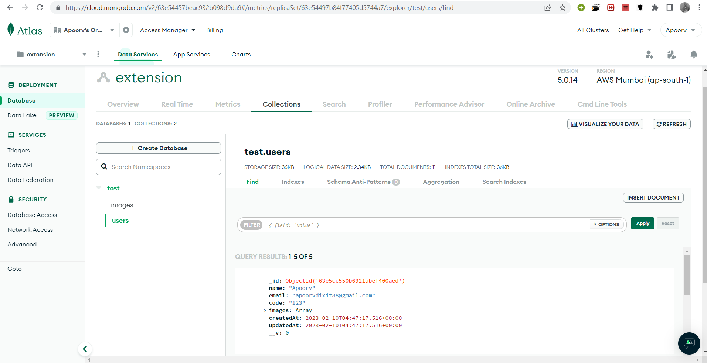

# Proctoring Extension

# Overview!

A Chrome extension that operates on assessment websites, activating when a user opens a test page. It opens a form for the user to enter their name, email, and test invitation code, and upon clicking the "Start Test" button, the user's information is sent to the backend server for storage. The extension performs a camera and audio check, and initiates image proctoring, sending images to the server every three minutes (configurable). All image and user activity data are stored on the backend server.

An admin panel is provided to view user details (Along with timestamp of images).

</p>

<p align="center">
  
</p>

## Clone to Local Storage

Open terminal and Clone the extesion using git:

```bash
$ git clone "https://github.com/apoorvdixit88/proctor"
```

## Install Locally

1. Open chrome and navigate to extensions page using this URL: [`chrome://extensions`](chrome://extensions).
1. Make sure "**Developer mode**" is enabled.
1. Click "**Load unpacked extension**" button, browse the `path/proctor` directory and select it.


Click the extension that gets appeared on top right corner.


<!--  -->

<br>

## Run Locally

Open two terminals for backend and admin dashboard(frontend)

- For backend:

```bash
$ cd backend # moving to directory

$ npm i # install dependencies

$ nodemon app.js #run server for backend
```

- For Frontend Admin-Dashboard

```bash
$ cd admin # moving to directory

$ npm i # install dependencies

$ npm start # run server for dash board
```

Note: React and node should be installed.

### Dashboard



We can use search email feature to fetch images of a particular user clicked during proctoring session.

### User Images



<!-- dashboard_img.PNG -->

<br>

Now storage needs to be setup!

## Creating S3 Bucket

1. Setup cloud bucket to store/retrieve photos: [Link](https://docs.aws.amazon.com/AmazonS3/latest/userguide/creating-bucket.html)
2. Create Access Key and Security Key for the bucket. This can be done after bucket being creater(by changing permissions for a user) or during time of user creation. ([Refer](https://aws.amazon.com/premiumsupport/knowledge-center/create-access-key/))

[For aws reference](https://docs.aws.amazon.com/AmazonS3/latest/userguide/creating-bucket.html)

The created bucked will look like!


## Creating Mongo Cluster

MongoDB will store form data as well all the reference links of all images of a particular user.
Create Mongo Cluster to store User's Data: [Link](https://www.mongodb.com/basics/clusters/mongodb-cluster-setup)



## Defining Environment Variables

Enter the following variables in .env after creating bucket and mongo cluster. (.env file present in backend directory)

AWS_BUCKET_NAME = "" <br>
AWS_BUCKET_REGION = "" <br>
AWS_ACCESS_KEY = ""<br>
AWS_SECRET_KEY = ""<br>
MONGO_URL = ""<br>

The extension will work fine once clicked, after specifying environment variables, all the data can be pushed or retrieved easily.
